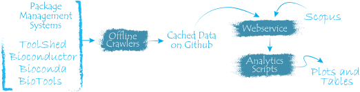

1. [Download, install, and start](https://docs.docker.com/desktop/#download-and-install)
Docker Desktop.

2. Clone the repository

    ```shell
    $ git clone https://github.com/genometric/tvq .
    ```

3. Start the webservice

    ```shell
    $ docker-compose up
    ```

    This will download and build required docker images and
    containers. When ready, you'll see a message as the following
    on your terminal:

    ```shell
    tvq_service | Hosting environment: Development
    tvq_service | Content root path: /app
    tvq_service | Now listening on: http://[::]:80
    tvq_service | Application started. Press Ctrl+C to shut down.
    ```

4. Now you can access the webservice via its API endpoints;
on your favorite Web browser open the following URL:
[http://localhost:8000/api/v1/repositories](http://localhost:8000/api/v1/repositories).

 For a complete API documentation, you may refer to the
[Swagger API docs](https://genometric.github.io/TVQ/api/).

These steps start the TVQ [webservice](../webservice/about) that
can query package management systems (e.g., Bioconda and Bioconductor)
for information about the tools they host, and search
for their citation on Scopus. Then service can then compute
descriptive statistics about the tools and their citation information,
and can export data for statistical analysis using the
[analytics scripts](../analytics/about). The Webservice is one of the
three components of the stack used for this study. The components
are:

- [**Offline crawlers**](../offline_crawlers/about)—_you do not need to run them_;
they collect some information about tools that are resource-expensive. These
crawlers are run by the maintainers of this project, and their output is
cached on github to be used by the Webservice.
- [**Webservice**](../webservice/about); this is the service you started
using the above-mentioned steps.
- [**Analytics scripts**](../analytics/about); these are python scripts that
take data generated by Webservice, perform statistical analysis, and
report their results in tables and plots.

The following figure is an abstract illustration of the components,
you may refer to the [overview](../about/overview) page for details.

<p align="center">
    <br/>
    
</p>
